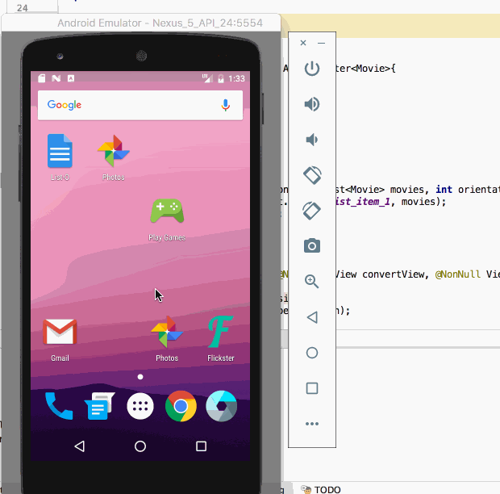

# Project 1 - *Flickster*

**Flickster** shows the latest movies currently playing in theaters. The app utilizes the Movie Database API to display images and basic information about these movies to the user.

Time spent: **9** hours spent in total

## User Stories

The following **required** functionality is completed:

* [x] User can **scroll through current movies** from the Movie Database API
* [x] Layout is optimized with the [ViewHolder](http://guides.codepath.com/android/Using-an-ArrayAdapter-with-ListView#improving-performance-with-the-viewholder-pattern) pattern.
* [x] For each movie displayed, user can see the following details:
* [x] Title, Poster Image, Overview (Portrait mode)
* [x] Title, Backdrop Image, Overview (Landscape mode)

The following **optional** features are implemented:
* [x] Display a nice default [placeholder graphic](http://guides.codepath.com/android/Displaying-Images-with-the-Picasso-Library#configuring-picasso) for each image during loading.

The following **bonus** features are implemented:
* [x] Apply rounded corners for the poster or background images using [Picasso transformations](https://guides.codepath.com/android/Displaying-Images-with-the-Picasso-Library#other-transformations)
* [x] Replaced android-async-http network client with the popular [OkHttp](http://guides.codepath.com/android/Using-OkHttp) networking libraries.

## Video Walkthrough

Here's a walkthrough of implemented user stories:

## Notes

Describe any challenges encountered while building the app.

## Open-source libraries used

- [okhttp](https://github.com/square/okhttp) - An HTTP+HTTP/2 client for Android and Java applications
- [Picasso](http://square.github.io/picasso/) - Image loading and caching library for Android

## License

Copyright [2017] [Sriram Santosh Aripirala]

Licensed under the Apache License, Version 2.0 (the "License");
you may not use this file except in compliance with the License.
You may obtain a copy of the License at

http://www.apache.org/licenses/LICENSE-2.0

Unless required by applicable law or agreed to in writing, software
distributed under the License is distributed on an "AS IS" BASIS,
WITHOUT WARRANTIES OR CONDITIONS OF ANY KIND, either express or implied.
See the License for the specific language governing permissions and
limitations under the License.

